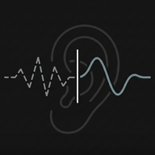

<p align="center">
  
</p>

<h1 align="center">🎧 Clear Hear</h1>

<p align="center">
  <strong>Real-time hearing enhancement for Android</strong><br/>
  Turn your phone into a powerful hearing aid with noise reduction, equalization, and device routing.
</p>

<p align="center">
  
  
  
  
</p>

---

## ✨ Features at a Glance

| | Feature | Description |
|---|---|---|
| 🔊 | **Real-time Passthrough** | ~100ms latency at 48 kHz / 16-bit mono |
| 🔇 | **3 Noise Reduction Modes** | OFF, Light, and Extreme |
| 🎛️ | **6-Band Equalizer** | Two EQ modes with 5 saveable profiles |
| 📱 | **Device Selection** | Built-in mic, Bluetooth, USB, wired headsets |
| 🔄 | **Background Processing** | Foreground service keeps audio running |
| 📊 | **CSV Logging** | Detailed audio metrics for analysis |

---

## 🚀 Getting Started

### Prerequisites

| Tool | Version |
|------|---------|
| 🛠️ Android Studio | Hedgehog or later |
| 📦 Android SDK | 35 |
| ☕ JDK | 17 |
| 📱 Device | Physical device recommended |

> ⚠️ Emulators lack real microphone/speaker routing — use a physical device for best results.

### 🏗️ Build & Run

```
1. Open the project in Android Studio
2. Connect a physical Android device
3. Build and run the `app` module
4. Grant permissions when prompted
```

### 🎬 First Use

1. 🎧 Plug in wired headphones or connect a Bluetooth headset
2. 🎚️ Adjust **Gain** and **Master Volume** (default `100` = 1.0x)
3. 🔘 Select a **Noise Reduction** mode
4. ▶️ Tap **START** — audio processing begins
5. ⏹️ Tap **STOP** to end

> 💡 **Pro Tip:** Always use headphones to avoid feedback loops between speaker and microphone!

---

## 🔇 Noise Reduction Modes

<table>
  <tr>
    <th>Mode</th>
    <th>Icon</th>
    <th>Best For</th>
    <th>How It Works</th>
  </tr>
  <tr>
    <td><strong>OFF</strong></td>
    <td>🟢</td>
    <td>Quiet rooms, maximum clarity</td>
    <td>Pure passthrough — no processing, just gain + volume</td>
  </tr>
  <tr>
    <td><strong>LIGHT</strong></td>
    <td>🟡</td>
    <td>Office, home, mild noise</td>
    <td>Gentle filtering with selectable strategy</td>
  </tr>
  <tr>
    <td><strong>EXTREME</strong></td>
    <td>🔴</td>
    <td>Crowds, traffic, loud places</td>
    <td>Aggressive spectral noise suppression</td>
  </tr>
</table>

### 🔧 Light Mode Strategies

Choose from four filtering approaches when using Light mode:

> 🤖 **Android Effects** *(default)*
> Uses hardware DSP — NoiseSuppressor, AutomaticGainControl, EchoCanceler. Low CPU, but results vary by device.

> 📉 **High-Pass Filter**
> Removes low-frequency rumble below 80 Hz. Consistent across all devices.

> 🚪 **Adaptive Gate**
> High-pass filter + adaptive noise gate. Learns ambient noise level, silences noise during pauses while preserving speech.

> 🎯 **Custom Profile**
> Record 5 seconds of your environment's noise — the app builds a personalized filter tuned to that exact noise pattern.

---

## 🎛️ Equalizer

Shape your audio across 6 frequency bands covering the human speech range:

```
 250 Hz ──┬── 500 Hz ──┬── 1 kHz ──┬── 2 kHz ──┬── 4 kHz ──┬── 8 kHz
   🔈     │    🔈      │    🔊     │    🔊     │    🔊     │    🔊
```

### 🔀 Two EQ Modes

| Mode | Description |
|------|-------------|
| **➕ Additive (dB)** | Boost or cut each band in decibels |
| **✖️ Multiplier (%)** | Scale each band as a percentage (0–200%) |

### 💾 5 Profiles

Save different EQ setups across **5 independent profiles** — each stores its own gain, volume, and all 6 band settings.

| Profile 1 | Profile 2 | Profile 3 | Profile 4 | Profile 5 |
|:---------:|:---------:|:---------:|:---------:|:---------:|
| 🟦 Teal | 🟨 Amber | 🟧 Coral | 🟪 Lavender | 🟩 Green |

Switch between them instantly — even while audio is running! 🔄

---

## 📱 Device Selection

Tap **🎤 Mic** or **🔈 Speaker** to choose your audio devices.

<table>
  <tr>
    <th>🎤 Input Devices</th>
    <th>🔈 Output Devices</th>
  </tr>
  <tr>
    <td>📱 Built-in microphone</td>
    <td>📱 Built-in speaker</td>
  </tr>
  <tr>
    <td>🔵 Bluetooth SCO / BLE mic</td>
    <td>🔵 Bluetooth A2DP / SCO / BLE</td>
  </tr>
  <tr>
    <td>🎧 Wired headset microphone</td>
    <td>🎧 Wired headphones</td>
  </tr>
  <tr>
    <td>🔌 USB audio input</td>
    <td>🔌 USB audio output</td>
  </tr>
</table>

> 🔄 Auto-detects available devices and handles Bluetooth SCO activation automatically.

---

## 🔧 Post-Filter

An optional post-processing stage applied **after** noise reduction and EQ:

- ⚡ **DC Blocker** — Removes DC offset
- 🚪 **Adaptive Noise Gate** — Fast attack (2ms), smooth release (50ms), -18dB noise reduction

Toggle from the **Advanced Options** section.

---

## 📊 Logging & Diagnostics

The app logs audio metrics every 100ms in CSV format:

| Metric | Details |
|--------|---------|
| 📈 Levels | Input/output RMS and peak |
| 🎚️ Settings | Gain and volume multipliers |
| 🔧 Mode | Active mode and device routing |
| 📏 SNR | Signal-to-noise ratio (Extreme mode) |

### 📁 Log Actions

| Action | What It Does |
|--------|-------------|
| 📤 **Export Logs** | Copies today's logs to Downloads folder |
| 🗑️ **Clear Logs** | Removes all historical log files |
| 🎙️ **Record Noise Profile** | Captures 5s of ambient noise for Custom Profile |

```
📂 Log location: Android/data/com.clearhear/files/logs/
```

---

## 🔐 Permissions

| Permission | Why | When |
|---|---|---|
| 🎤 `RECORD_AUDIO` | Capture microphone input | Runtime |
| 🔵 `BLUETOOTH_CONNECT` | Connect Bluetooth devices | Android 12+ |
| ⚙️ `FOREGROUND_SERVICE` | Background processing | Auto |
| 🔊 `MODIFY_AUDIO_SETTINGS` | Route audio to devices | Auto |
| 🔔 `POST_NOTIFICATIONS` | Service notification | Android 13+ |

---

## ⚙️ Technical Specs

```
┌─────────────────────────────────────────┐
│  📻  Sample Rate    48,000 Hz           │
│  🎵  Format         16-bit PCM, Mono    │
│  ⏱️  Chunk Size     100ms (4,800 smp)   │
│  ⚡  Latency        ~100–103ms          │
│  🏗️  Architecture   Strategy Pattern    │
└─────────────────────────────────────────┘
```

### 🔄 Processing Pipeline

```
🎤 Microphone
   ↓
📥 AudioRecord (capture)
   ↓
🔧 Mode Processor (OFF / Light / Extreme)
   ↓
🎛️ Equalizer (6-band)
   ↓
🔧 Post-Filter (optional)
   ↓
📤 AudioTrack (playback)
   ↓
🔈 Speaker / Headphones
```

---

<p align="center">
  Made with ❤️ for better hearing
</p>
